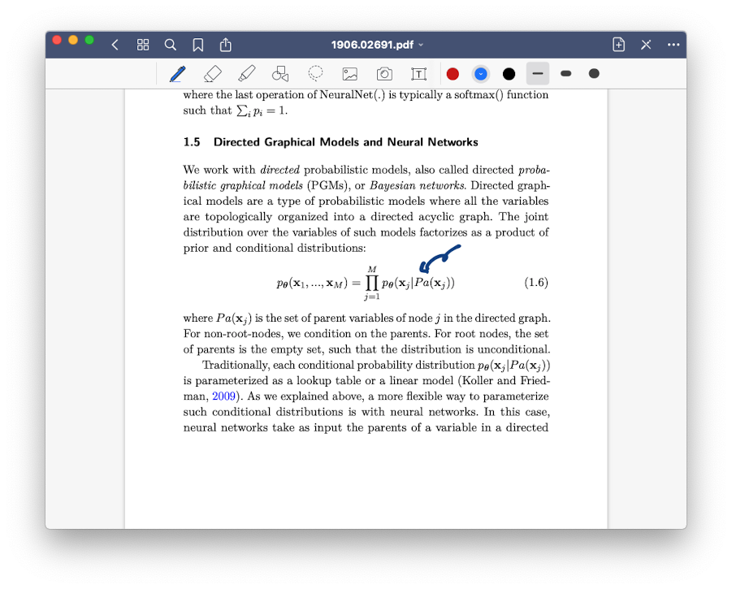
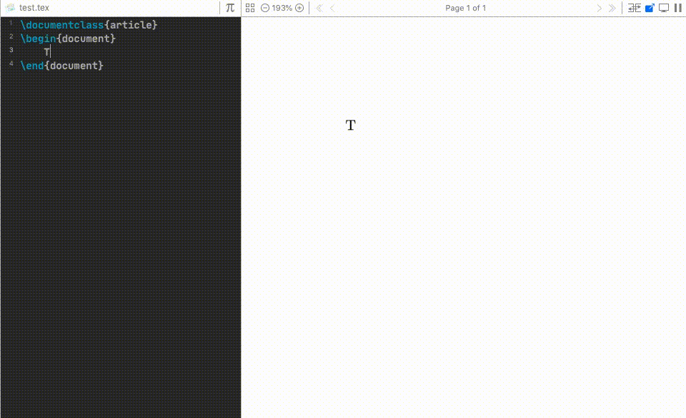
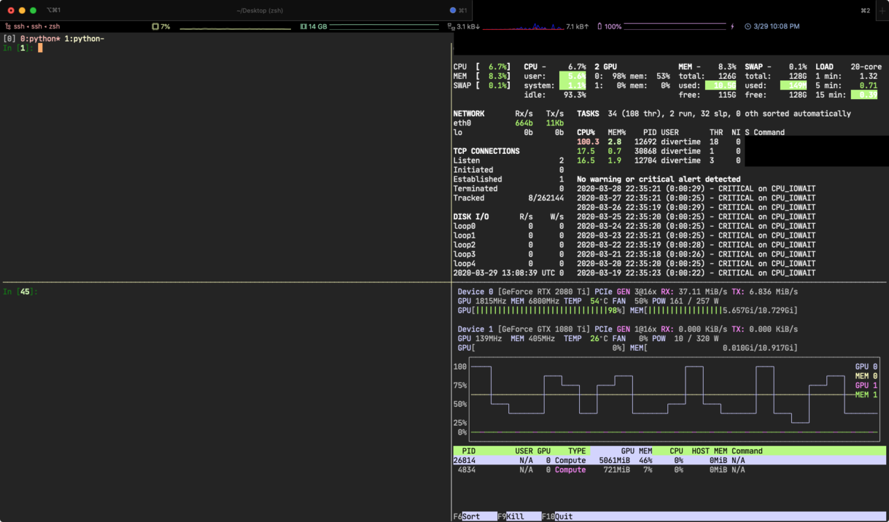
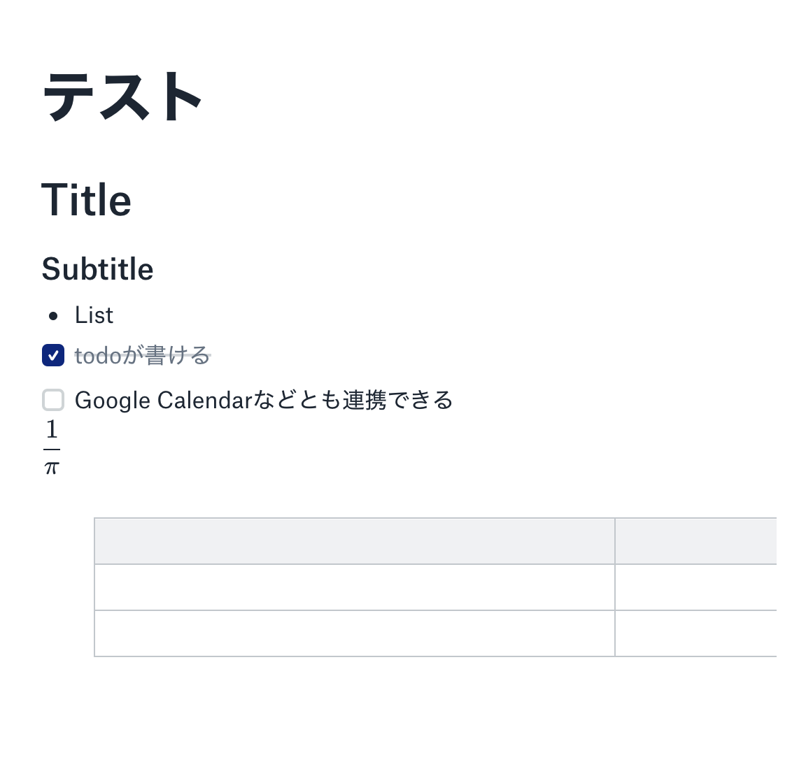

情報系の博士学生をしていて使っているツールなどをまとめてみました．しばらく自宅待機で研究室に行けない研究室入りたての人，などの役に立てば幸いです．

## 筆者の環境

ラップトップとしてMacBook Pro，タブレット端末としてiPad Pro+Apple Pencilを使っています．また，実験の際にはUbuntuの外部サーバーにアクセスすることを前提としています．

## 論文を読む

論文を読む際には[GoodNotes](https://www.goodnotes.com/)を使って，研究テーマやプロジェクトごとに論文をまとめた上で書き込んでいます．iPadとMacで同期して使うと端末の特徴に合わせた使い方ができます．例えば，論文に書き込みながら読むのにはiPadの方が向いていますし，複数の論文をテーマに応じてまとめるのはMacのほうが楽な気がします．



論文を管理する際にはMendeleyを使っています．Mendeley自体はサポートもあまり良くなく，使いにくいのですが，PDFファイルやbibファイルをドラッグ&ドロップで取り込むだけでbibファイルにまとめられます．また，PDFファイルからの情報抽出の精度が高い気がします．ただ最近はMendeleyはほとんど使っておらず，文献管理はメモをDropbox Paperに残すくらいになっています．

## 論文を書く

普段論文を書く際には[TeXPad](https://www.texpad.com/)を使っています．TeXPadはテキスト入力と同時にタイプセットされるので，直感的にLaTeXを書くことができます．補完もそれなりに強く，執筆に集中できます．



共著者が増えてくるとオンラインでLaTeXを用いた執筆ができる[Overleaf](http://overleaf.com/)も便利です．Overleaf上で多くの会議のテンプレートが配布されているのですが，日本語原稿の場合，Overleaf版を使うのが楽な気がします．ただし，大きな会議の締め切り直前にはOverleafがダウンすることもあるので，完全に頼るのは危険です．

私はOverleafとDropboxを連携させた上で，Dropbox上のファイルをTeXPadから執筆しています．これでMac上で快適に執筆して，共著者に最新版を確認してもらうことができます．ただし，共著者もOverleafで編輯する段階に入ったら，上書きなどを防ぐためにもOverleafに移行した方が良いでしょう． なお，しばしばTeXの環境構築は面倒なのですが，TeXPadやOverleafを使えば基本的にその面倒はありません．

図はmacOSに付属しているプレゼンツールであるkeynoteと，Illustrator代替ツールである[Affinity Designer](https://affinity.serif.com/ja-jp/designer/)を使っています．大体はkeynoteで事足ります．論文の図がさまざまな色覚の人が見ても誤解が生じないように[Sim-daltonism](https://itunes.apple.com/jp/app/sim-daltonism/id693112260?mt=12)を使って確認を行っています．

## コードを書く

大学院に入って以来，ほとんどのコーディングはPythonです．統合開発環境としては主に[PyCharm](https://www.jetbrains.com/ja-jp/pycharm/)を利用しています．非常に多くの機能がありますが，特に補間やリファクタリングが強力なこと，テストやデバックの支援があることが便利な点です．最近はJupyter Notebookも自然に使えます．

Python以外の言語や，Pythonでも1，2ファイル程度の簡単なプログラムを書くときには[VSCode](https://azure.microsoft.com/ja-jp/products/visual-studio-code/)も使っています．VSCodeはリモートサーバーのファイルを編輯する機能もあり，一時期使っていたのですが，結局後述するrsyncでの運用に戻りました．

実験設定は[hydra](https://hydra.cc/)を使ってyamlにまとめています．hydraを使うと，例えばデータセットごとの設定を切り分けることができるので，バグの温床となりやすい同じ設定を何度も書いてしまうことを防げます． 設定を作る際には[情報系研究者のためのtips 2019年度版](https://qiita.com/guicho271828/items/3664aec81f6cc7e8f179)にもあるように

> 「機能をオンにする」 フラグを書き、「機能をオフにする」フラグは書かない

設定を書くのがわかりやすいです．名前の付け方を工夫することでデフォルトがオフの設定を書くことができます．例えば更新を行うことが初期値で設定によって更新を抑制したいなら`avoid_update=false`のようなフラグを書きます．

しばしば実験ログの上書きなどという問題があるかと思いますが，hydraは実験時の出力をoutputs以下のよしななディレクトリにまとめてくれるので便利です．

テストにはpytestを利用しています．間違いがあると致命的そうな函数に対してはテストを書いておいたほうが良いですが，大体バグは問題ない，と思ったところにあります．

各所で推薦されていますが，[リーダブルコード](https://amzn.to/3cJOxxU)にはメンテナンスしやすいコードを書く方法が書かれており一読の価値があります．研究のコードはたとえ公開しなくても，研究室内で共有したり，あるいは忘れた頃に自分が読んだりすることがあります．ある程度可読性のあるコードを書くことは不可欠です．

## 実験をする

研究室では複数のサーバーが利用可能なので，Mac上で開発を行い，`rsync`を使って現在使えるサーバーと開発レポジトリを同期しています．この運用は[D. Tran兄貴の記事](http://dustintran.com/blog/a-research-to-engineering-workflow)に倣っています．

```text 
rsync -avz --delete --exclude-from $HOME/.rsync_exclude $PWD server:
```

`$HOME/.rsync_exclude` にはrsyncに処理されたくないディレクトリやファイルをまとめておきます．

```text
.idea
notebooks
outputs
results
```

`.idea`はPyCharmの設定ファイルでサーバーに送りたくないので指定しています．`outputs`や`results`はログや重みの保存先で，rsyncに消されないように指定しています．

プロジェクトごとに仮想環境を使い分けるためにcondaと[direnv](https://github.com/direnv/direnv)を使っています．condaはPythonの環境構築に行い，direnvはディレクトリごとの環境変数を設定します．例えば以下ではenvnameという仮想環境を作り，project_dirではenvname環境を利用するようにしています．

```bash
conda create -n envname python=3.8
conda install foo bar

cd project_dir
echo "layout conda envname" >> .envrc
direnv allow
```

リモートサーバー上ではターミナルを分割するtmuxを使って複数の実験を行えるようにしています．接続が切れても処理が終わらないのも便利です．画面右側は[glances](https://github.com/nicolargo/glances)と[nvtop](https://github.com/Syllo/nvtop)でプロセスの監視をしています．



巨大なデータセットのダウンロードや重みなどのバックアップにはrcloneを利用して，研究室のGoogle Driveにコピーしています．rcloneはrsyncのようなコマンドでGoogle DriveやDropboxとのファイル共有が可能です．

```bash
rclone copy -v remote:datasets/imagenet.tar .
rclone copy -v project_dir remote:project_dir
```

## 情報の管理

情報の管理は難しく，今も試行錯誤中です．

一番長続きしているのがDropbox Paperで，研究のアイディアや，Todo，指導教員とのミーティングなどの文書をまとめています．数式が表示できること，他の文書とリンクできること，Google Calendarとの連携，編集履歴が分かる点，などが便利なポイントです．また，複数人で同時に編集できるので，リモートで議論しながら編集すると作業が捗ります．

